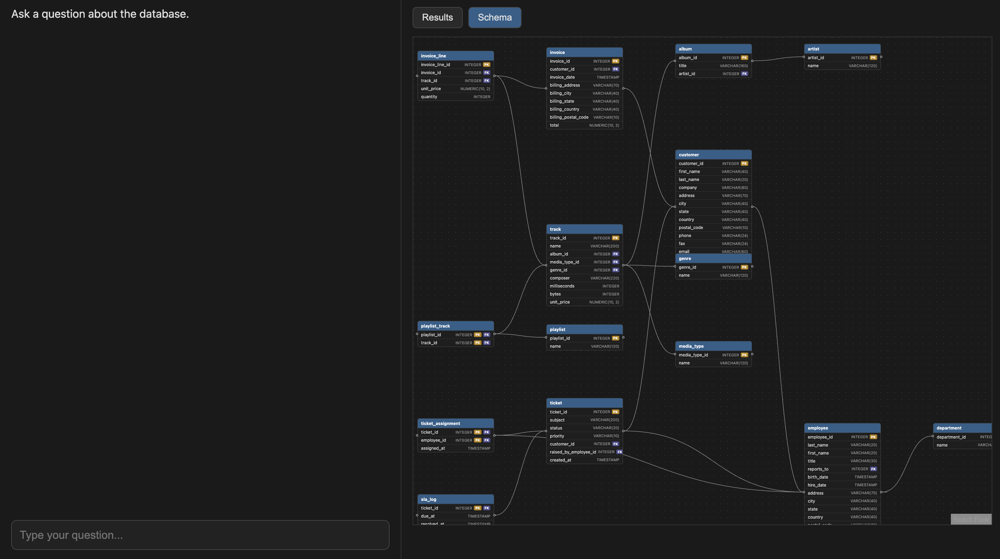
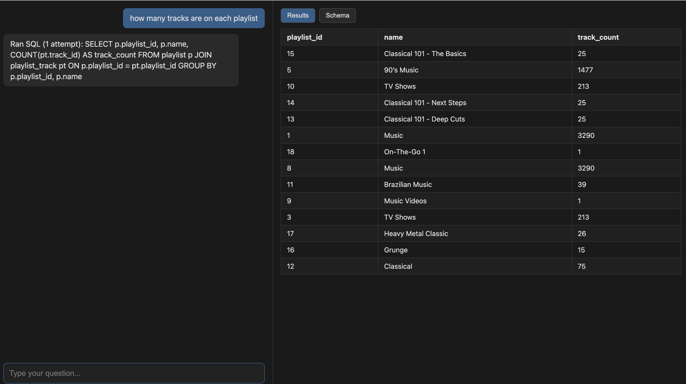

# QueryScope
Natural language to validated SQL, over your own Postgres schema — with retrieval-augmented context, graph-aware expansion, and hallucination-proof validation before anything executes.

## Why this exists
Most "chat with your database" tools either:
- Stuff the full schema into every prompt (works fine on toy databases, falls apart past ~15-20 tables), or
- Skip validation entirely and just run whatever SQL the LLM produces, hallucinated columns and all.

QueryScope treats schema retrieval and SQL validation as first-class pipeline stages, not afterthoughts. The core bet: an LLM given a correct, minimal, relevant slice of schema — and a validator that catches anything it still gets wrong — produces trustworthy SQL far more reliably than one given everything or nothing.

## Pipeline overview
```
question
   │
   ▼
[1] classify        →  data_question / general_question / out_of_scope
   │
   ▼ (data_question only)
[2] retrieve         →  embed question, pgvector similarity search → top-k relevant tables
   │
   ▼
[3] expand           →  one-hop FK expansion → catch join/bridge tables retrieval missed
   │
   ▼
[4] describe          →  build schema_context from retrieved + expanded table descriptions
   │
   ▼
[5] generate          →  LLM (Groq) generates SQL against schema_context
   │
   ▼
[6] validate          →  sqlglot AST checks: parses? is SELECT? tables/columns real?
   │                     invalid? → feed specific error back to [5], retry (max 3 attempts)
   ▼ (only if valid)
[7] execute           →  run against Postgres, return rows
```

Each stage is a separate module. `pipeline_router.py` / `pipeline.py` wire them together behind a single `handle_query()` entry point.

## Stages
- **Classify** — routes the question into `data_question`, `general_question`, or `out_of_scope`; only `data_question` enters the pipeline below.
- **Ingest** — reads live Postgres schema (tables, columns, PKs, FKs) into in-memory Python objects, once, via SQLAlchemy's `inspect()`.
- **Describe + Embed** — LLM writes a semantic text description per table; embedded with sentence-transformers and stored in Postgres via pgvector.
- **Retrieve** — embeds the question, does a pgvector similarity search to pull the top-k most relevant tables.
- **Expand** — adds any table one FK-hop away from the retrieved set, to catch join/bridge tables retrieval missed.
- **Generate** — LLM (Groq) writes SQL scoped only to the retrieved + expanded schema context.
- **Validate** — sqlglot parses the SQL and checks it's a `SELECT`, and that every referenced table/column actually exists (alias-resolved), rejecting with the specific hallucinated name if not. On failure, the specific error is fed back to Generate and retried, up to 3 attempts, before returning a final rejection — the only part of the pipeline where the LLM gets a second, bounded try at fixing its own mistake.
- **Execute** — only SQL that passes validation runs against Postgres; rows are returned.

## Frontend
Split-screen interface:
- **Left pane** — chat, where you ask questions in plain English.
- **Right pane** — toggle between:
  - **Results view** — the executed query's returned rows.
  - **Schema view** — an interactive, force-directed diagram of the full database schema (built with React Flow), showing every table, its columns with types, PK/FK badges, and the foreign key relationships connecting them.

## eaxmple





## Setup

### Prerequisites
- Python 3.10+
- PostgreSQL with the pgvector extension installed
- A Groq API key
- Node.js (for the frontend)

Trying it quickly? A seeded Chinook + HR-extension database (customers, invoices, tracks — plus tickets, departments, SLA logs bolted on) ships in this repo under `db/`, so you can run the full pipeline immediately without setting up your own schema. Just load it into your local Postgres before running the ingest steps below.

### 1. Clone
```
git clone <repo-url>
cd query-scope
```

### 2. Backend
```
cd backend
python -m venv venv
source venv/bin/activate     # Windows: venv\Scripts\activate
pip install -r requirements.txt
```

Create `backend/.env`:
```
GROQ_API_KEY=your_groq_api_key_here
DATABASE_URL=postgresql://user@localhost/your_db
```

Enable pgvector on your local Postgres instance and create the embeddings table:
```sql
CREATE EXTENSION IF NOT EXISTS vector;

CREATE TABLE table_embeddings (
    table_name TEXT PRIMARY KEY,
    description TEXT,
    embedding vector(384)
);
```

Ingest your schema and populate embeddings (one-time, or whenever schema changes):
```
python ingest.py
python describe.py
python embed.py
```

Run the API:
```
uvicorn main:app --reload
```

#### Pointing at a different database
Ingestion is schema-agnostic — it reads whatever's live at `DATABASE_URL`, not anything hardcoded to Chinook. To use your own Postgres database instead: change `DATABASE_URL` in `.env`, then re-run the three ingest/describe/embed steps above against it. No code changes needed.

### 3. Frontend
```
cd frontend
npm install
npm run dev
```

## Design notes / decisions
- **Table descriptions are LLM-generated, not templated.** A static "table: name, columns: [...]" format is deterministic but semantically flat — it embeds poorly because it doesn't read like natural language. LLM-written descriptions embed closer to how a person would phrase a question about that data.
- **Embeddings are table-level, not column-level.** Keeps retrieval fast and the embeddings table small; column-level detail is handled downstream by validation instead.
- **One-hop expansion, not full graph traversal.** Keeps schema context bounded and purposeful instead of snowballing across a richly connected schema.
- **Validation returns specific missing names, not booleans.** Needed for actionable, specific rejection messages rather than an opaque "invalid SQL."
- **All SQL execution is gated on validation passing.** No generated SQL runs against the live database unchecked, and only `SELECT` statements are ever permitted through — no `INSERT`/`UPDATE`/`DELETE`/`DROP` reaches execution regardless of what the LLM produces.
- **Parameterized queries throughout**, including retrieval's own pgvector query — no raw string interpolation of any value that could plausibly trace back to user input.